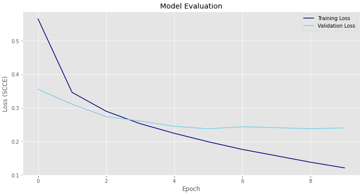

# Neural Network Mini-hackathon Fashion MNIST 👗👔

## Overview

The Fashion-MNIST dataset is a collection of images of clothing items. It was created as a replacement for the original MNIST dataset, which has become too easy for modern machine learning algorithms. The goal of this project is to develop a machine learning model that can accurately classify these images into their corresponding categories. The project involves various steps such as preprocessing the data, building and training the model, and evaluating its performance.

## Problem Statement

Can a Convolutional Neural Network (CNN) be used to classify images of clothing items into their respective categories?

## Data

The dataset consists of 70,000 images, with 60,000 images for training and 10,000 images for testing. Each image is 28x28 pixels in size and is represented as a flattened array of 784 values. The 10 categories of clothing items in the dataset are:

- T-shirt/top
- Trouser
- Pullover
- Dress
- Coat
- Sandal
- Shirt
- Sneaker
- Bag
- Ankle boot

The dataset can be downloaded from [Kaggle](https://www.kaggle.com/datasets/zalando-research/fashionmnist?select=fashion-mnist_train.csv).

## Methodology

Data Preparation: The dataset was loaded and split into training and validation sets. The pixel values were MinMax scaled to improve the performance of the model.

Model Building: A convolutional neural network (CNN) was built using Keras. The CNN consists of two convolutional layers(64 and 128 nodes), followed by two pooling layers, and two fully connected layers.

Model Training: The model was trained on the training set using the RMSProp optimizer and sparse categorical cross entropy loss function. The model was trained for 10 epochs with a batch size of 128.

Model Evaluation: The model was evaluated on the testing set, and the accuracy was calculated.

Model Improvement: The model was further improved by adding more convolutional layers and increasing the number of filters in each layer. The model was trained and evaluated again on the entire training set to compare the performance with the previous version.

Final Model Selection: The best-performing model was selected based on the evaluation metrics.

## Conclusion

The results of this project demonstrate that the model performed with 92% accuracy. This accuracy score indicates that the model was very successful in correctly classifying the images into their respective categories. Many of the labels that were misclassified by the model would also be misclassified by the human eye. This suggests that the model was able to learn the features of the images accurately. This project demonstrates the efficacy of using CNNs and Tensorflow to classify images into their respective categories with a high degree of accuracy.

